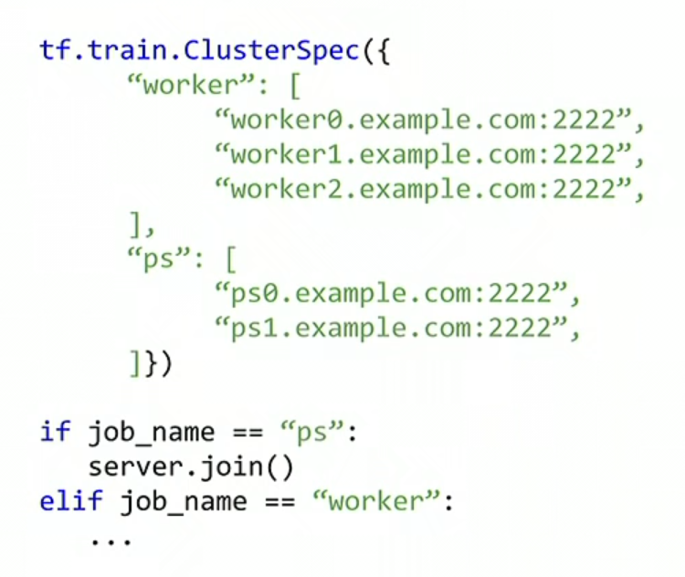
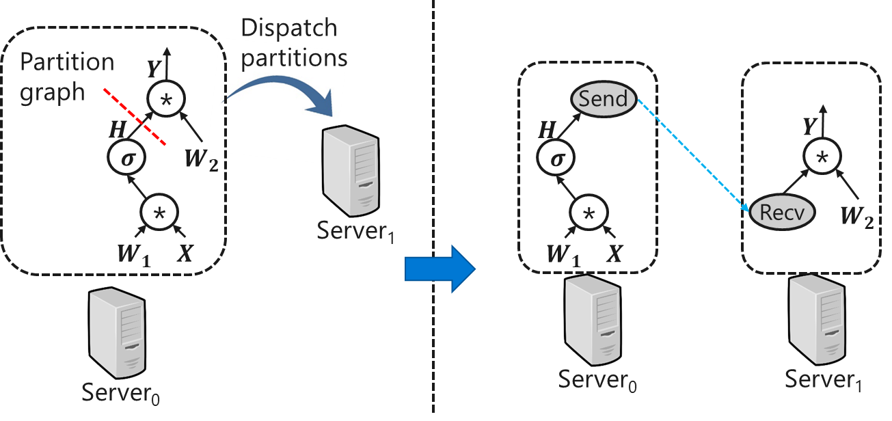
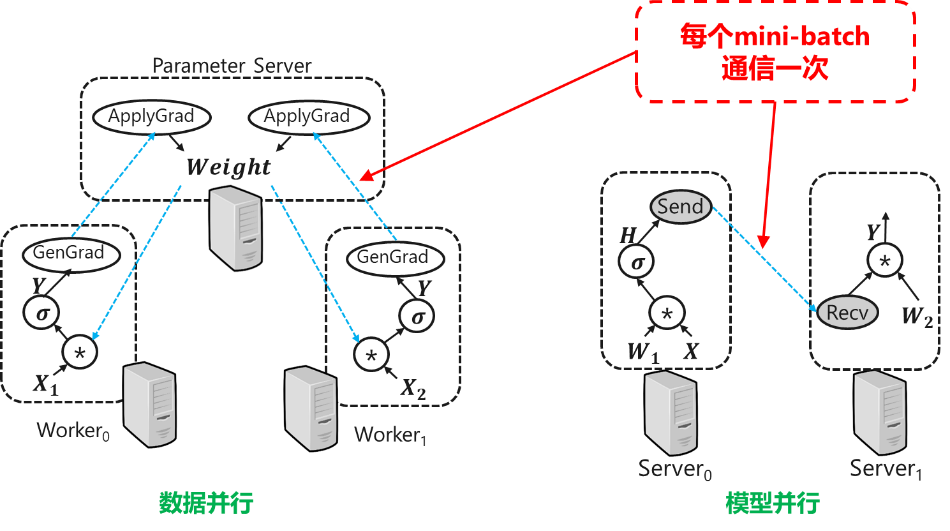
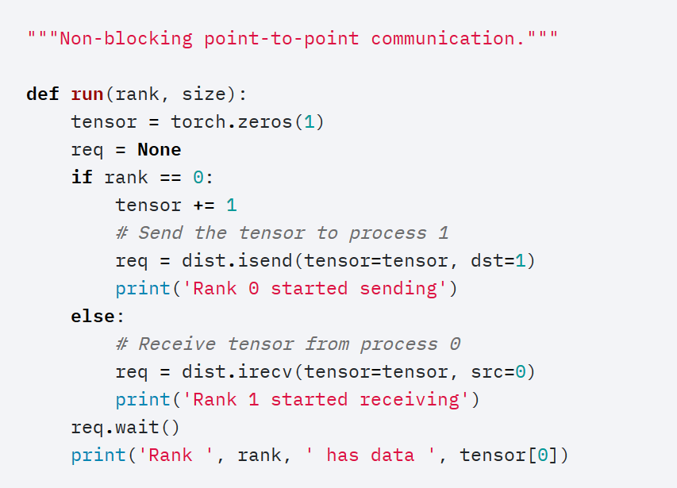
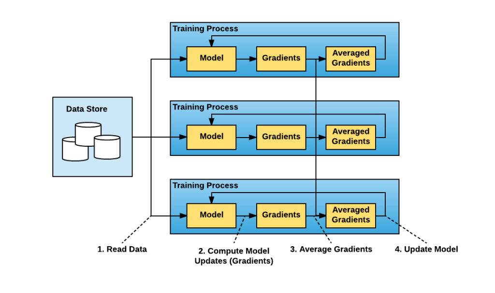
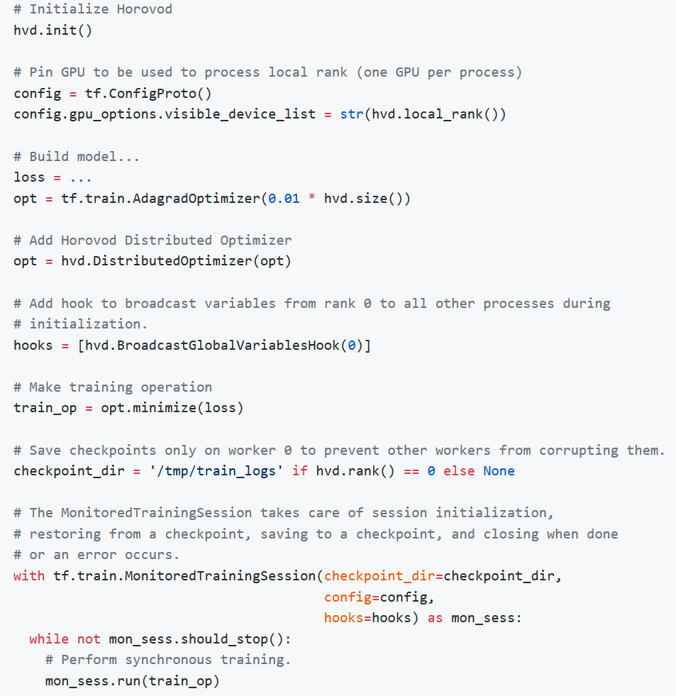

<!--Copyright © Microsoft Corporation. All rights reserved.
  适用于[License](https://github.com/microsoft/AI-System/blob/main/LICENSE)版权许可-->

# 6.5 分布式训练系统简介
------------------

模型的分布式训练依靠相应的分布式训练系统协助完成。这样的系统通常分为：分布式用户接口、单节点训练执行模块、通信协调三个组成部分。用户通过接口表述采用何种模型的分布化策略，单节点训练执行模块产生本地执行的逻辑，通信协调模块实现多节点之间的通信协调。系统的设计目的是提供易于使用，高效率的分布式训练。

目前广泛使用的深度学习训练框架例如Tensor
Flow和PyTorch已经内嵌了分布式训练的功能并逐步提供了多种分布式的算法。除此之外，也有单独的系统库针对多个训练框架提供分布训练功能，例如Horovod等。

目前分布式训练系统的理论和系统实现都处于不断的发展当中。我们仅以TensorFlow、PyTorch和Horovod为例，从用户接口等方面分别介绍他们的设计思想和技术要点。

## 6.5.1 TensorFlow

经过长期的迭代发展，目前TensorFlow通过不同的API支持多种分布式策略(distributed
strategies)，如下表所示。其中最为经典的基于参数服务器“Parameter
Server”的分布式训练，TensorFlow早在版本(v0.8)中就加入了。其思路为多worker独立进行本地计算，分布式共享参数。

  
 | Training API               | MirroredStrategy       | TPUStrategy            | MultiWorker-MirroredStrategy   | CentralStorage-Strategy    | ParameterServer-Strategy     | OneDeviceStrategy | 
 | -- | -- | -- | -- | -- | -- | -- |
 |**Keras API**  |     Supported  |    Experimental support |  Experimental support  |    Experimental support  |  Supported planned post 2.0 |  Supported |
 |**Custom training loop** | Experimental support | Experimental support | Support planned post 2.0  |  Support planned post 2.0 | No support yet  | Supported |
 |**Estimator API**  |   Limited Support  |  Not supported  |   Limited Support  |  Limited Support  |    Limited Support  |     Limited Support |

  -------------------------- ---------------------- ---------------------- ------------------------------ -------------------------- ---------------------------- -------------------

https://www.tensorflow.org/guide/distributed\_training

TensorFlow参数服务器用户接口包含定义模型和执行模型两部分。如下图所示，其中定义模型需要完成指定节点信息（PS,worker）以及将
“原模型”逻辑包含于worker 节点；而执行模型需要指定角色 job\_name是
ps还是worker，以及通过index指定自己是第几个ps/worker。

<!-- {width="3.9198851706036746in"
height="3.3031561679790027in"} -->

图: TensorFlow 定义节点信息和参数服务器方式并行化模型

<!-- **cluster = tf.train.ClusterSpec({"worker": {1:
"worker1.example.com:2222"},** -->

<!-- **"ps": \["ps0.example.com:2222",**

**"ps1.example.com:2222"\]})**

**If job\_name == “ps”:**

**server.join()**

**elif job\_name == “worker”:**

**…** -->

<https://www.tensorflow.org/api_docs/python/tf/train/ClusterSpec>

在TensorFlow的用户接口之下，系统在底层实现了数据流图的分布式切分。如下图所示的基本数据流图切分中，TensorFlow根据不同operator的设备分配信息，将整个数据流图图划分为每个设备的子图，并将跨越设备的边替换为“发送”和“接收”的通信原语。

<!-- {width="4.409722222222222in"
height="2.08125in"} -->

图：数据流图的跨节点切分

<!-- {width="4.319444444444445in"
height="2.4131944444444446in"} -->

图: 采用参数服务器并行的数据流图

在参数服务器这样的数据并行中，参数以及更新参数的操作被放置于参数服务器之上，而每个worker负责读取训练数据并根据最新的模型参数产生对应的梯度并上传参数服务器。而在其它涉及模型并行的情况下，每个worker负责整个模型的一部分，相互传递激活数据进行沟通协调，完成整个模型的训练。

我们可以注意到每条跨设备的边在每个mini-batch中通信一次，频率较高。而传统的实现方式会调用通信库将数据拷贝给通信库的存储区域用于发送，而接收端还会将收到通信库存储区域的数据再次拷贝给计算区域。多次的拷贝会浪费存储的空间和带宽。

而且由于深度模型训练的迭代特性，每次通信都是完全一样的。因此，我们可以通过“预分配+RDMA+零拷贝”的方式对这样的通信进行优化。其基本思想是将GPU中需要发送的计算结果直接存储于RDMA网卡可见的连续显存区域，并在计算完成后通知接收端直接读取，避免拷贝（[Fast Distributed Deep Learning over RDMA. EuroSys'19](<https://dblp.org/db/conf/eurosys/eurosys2019.html>))。

通过这样的介绍我们可以看到，在TensorFlow训练框架的系统设计思想是将用户接口用于定义并行的基本策略，而将策略到并行化的执行等复杂操作隐藏于系统内部。这样的做法好处是用户接口较为简洁，无需显示地调用通信原语。但随之而来的缺陷是用户无法灵活地定义自己希望的并行及协调通信方式。

## 6.5.2 PyTorch

与TensorFlow相对的，PyTorch
的用户接口更倾向于暴露底层的通信原语用于搭建更为灵活的并行方式。PyTorch的通信原语包含**点对点通信**和**集体式**通信。

PyTorch 点对点通信可以实现用户指定的同步send/recv，例如下图表达了：rank 0 *send* rank 1 *recv* 的操作。

<!-- {width="4.607638888888889in"
height="2.7708333333333335in"} -->

图: PyTorch中采用点对点同步通信

[Figure from](<https://pytorch.org/tutorials/intermediate/dist_tuto.html>)

<!-- """Blocking point-to-point communication."""

def run(rank, size):

tensor = torch.zeros(1)

if rank == 0:

tensor += 1

\# Send the tensor to process 1

dist.send(tensor=tensor, dst=1)

else:

\# Receive tensor from process 0

dist.recv(tensor=tensor, src=0)

print('Rank ', rank, ' has data ', tensor\[0\]) -->

<!-- {width="4.607638888888889in"
height="3.3222222222222224in"} -->

除了同步通信，PyTorch还提供了对应的异步发送接收操作。

图: PyTorch中采用点对点异步通信

<!-- """Non-blocking point-to-point communication."""

def run(rank, size):

tensor = torch.zeros(1)

req = None

if rank == 0:

tensor += 1

\# Send the tensor to process 1

req = dist.isend(tensor=tensor, dst=1)

print('Rank 0 started sending')

else:

\# Receive tensor from process 0

req = dist.irecv(tensor=tensor, src=0)

print('Rank 1 started receiving')

req.wait()

print('Rank ', rank, ' has data ', tensor\[0\]) -->

[Figure from](<https://pytorch.org/tutorials/intermediate/dist_tuto.html>)

PyTorch 集体式通信包含了一对多的 Scatter / Broadcast， 多对一的 Gather / Reduce 以及多对多的 *All-Reduce* / *AllGather*。

<!-- {width="6.0in"
height="5.758333333333334in"} -->

图: PyTorch中的集体式通信

[Figure from](<https://pytorch.org/tutorials/intermediate/dist_tuto.html>)

下图以常用的调用All-Reduce为例，它默认的参与者是全体成员，也可以在调用中以列表的形式指定集体式通信的参与者。比如这里的参与者就是rank 0 和 1。

<!-- {width="6.0in"
height="2.0083333333333333in"} -->

图: 指定参与成员的集体式通信 

<!-- """ All-Reduce example."""

def run(rank, size):

""" Simple collective communication. """

group = dist.new\_group(\[0, 1\])

tensor = torch.ones(1)

dist.all\_reduce(tensor, op=dist.ReduceOp.SUM, group=group)

print('Rank ', rank, ' has data ', tensor\[0\]) -->

[Figure from](<https://pytorch.org/tutorials/intermediate/dist_tuto.html>)

通过这样的通信原语，PyTorch也可以构建数据并行等算法，且以功能函数的方式提供给用户调用。但是这样的设计思想并不包含TensorFlow中系统下层的数据流图抽象上的各种操作，而将整个过程在用户可见的层级加以实现，相比之下更为灵活，但在深度优化上欠缺全局信息。

## 6.5.3 Horovod

*“Horovod is a distributed deep learning training framework for
**TensorFlow, Keras, PyTorch**, and **Apache MXNet**. The goal of
Horovod is to make distributed deep learning fast and easy to use.”*

在各个深度框架针对自身加强分布式功能的同时，Horovod专注于数据并行的优化，并广泛支持多训练平台且强调易用性，依然获得了很多使用者的青睐。

<!-- {width="6.0in"
height="3.55625in"} -->

图: Horovod 实现数据并行的原理 

如果需要并行化一个已有的模型，Horovod在用户接口方面需要的模型代码修改非常少，其主要是增加一行利用Horovod的DistributedOptimizer分布式优化子嵌套原模型中优化子：

opt = DistributedOptimizer(opt)

而模型的执行只需调用mpi即可方便实现：

mpirun –n &lt;worker number&gt; train.py

<!-- {width="6.0in" height="6.176388888888889in"} -->

图: 调用 Horovod 需要的代码修改 

<!-- import torch

import horovod.torch as hvd

\# Initialize Horovod

hvd.init()

\# Pin GPU to be used to process local rank (one GPU per process)

torch.cuda.set\_device(hvd.local\_rank())

\# Define dataset...

train\_dataset = ...

\# Partition dataset among workers using DistributedSampler

train\_sampler = torch.utils.data.distributed.DistributedSampler(

train\_dataset, num\_replicas=hvd.size(), rank=hvd.rank())

train\_loader = torch.utils.data.DataLoader(train\_dataset,
batch\_size=..., sampler=train\_sampler)

\# Build model...

model = ...

model.cuda()

optimizer = optim.SGD(model.parameters())

\# Add Horovod Distributed Optimizer

optimizer = hvd.DistributedOptimizer(optimizer,
named\_parameters=model.named\_parameters())

\# Broadcast parameters from rank 0 to all other processes.

hvd.broadcast\_parameters(model.state\_dict(), root\_rank=0)

for epoch in range(100):

for batch\_idx, (data, target) in enumerate(train\_loader):

optimizer.zero\_grad()

output = model(data)

loss = F.nll\_loss(output, target)

loss.backward()

optimizer.step()

if batch\_idx % args.log\_interval == 0:

print('Train Epoch: {} \[{}/{}\]\\tLoss: {}'.format(

epoch, batch\_idx \* len(data), len(train\_sampler), loss.item())) -->

Horovod通过DistributedOptimizer 插入gradient allreduce逻辑实现数据并行。对于TensorFlow，插入通信 allreduce operator，而在PyTorch中插入通信 allreduce 函数。二者插入的操作都会调用底层统一的allreduce功能模块。

为了保证性能的高效性，Horovod实现了专用的**协调机制算法**：

目标：确保allreduce的执行全局统一进行

-   每个worker拥有allreduce 执行队列，初始为空

-   全局master，维护每个worker各个gradients 状态

执行：

-   worker\_i产生梯度g\_j后会调用allreduce(g\_j)，通知master “g\_j\[i\]
    ready”

-   当master收集到所有”g\_j\[\*\] ready”,
    通知所有worker将g\_i加入allreduce执行队列

-   worker背景线程不断pop allreduce队列并执行

这里需要确保allreduce全局统一执行主要为了：确保相同执行顺序，保证allreduce针对同一个梯度进行操作；allreduce通常是同步调用，为了防止提前执行的成员会空等，导致资源浪费。

Horovod通过一系列优化的设计实现，以独特的角度推进了分布式训练系统的发展。其中的设计被很多其它系统借鉴吸收，持续发挥更为广泛的作用。
